# slack-custom-emoji
Because existing emoji lack sufficient dank

Continuous Integration confirms each file matches Slack upload requirements

## Table o' Contents
- [Default Slack Emoji](#default-slack-emoji)
- [Other Resources Most Excellent](#other-resources-most-excellent)
- [Custom Emoji List](#custom-emoji-list)

-----

### Default Slack Emoji
- [How to use Slack emoji](https://get.slack.help/hc/en-us/articles/202931348-Emoji-and-emoticons)
- [Slack Emoji Cheat Sheet](https://www.webpagefx.com/tools/emoji-cheat-sheet/)

### Other Resources Most Excellent
- [Cult of the Party Parrot](http://cultofthepartyparrot.com/)
- [Many Many Other Custom Emoji](https://slackmojis.com/)

### Custom Emoji List

| Emoji | Suggested Text | Emoji | Suggested Text | Emoji | Suggested Text |
|:-----:|:--------------:|:-----:|:--------------:|:-----:|:--------------:|
|  | :aww: | 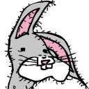 | :bogs: | 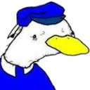 | :dolan-classic: |
| 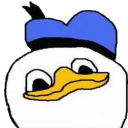 | :dolan: | 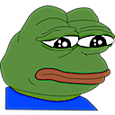 | :feels-bad-man: |  | :feels-good-man: |
|  | :feels-good: |  | :gooby: | 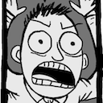 | :i-guess-with-emphasis: |
| 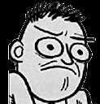 | :i-guess: | 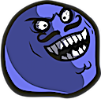 | :i-lied: | 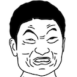 | :impossibru: |
|  | :troll-period: | 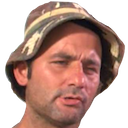 | :which-is-nice: | 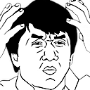 | :wtf: |
|  | :yey: | 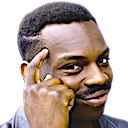 | :you-cant-if-you-dont: |
