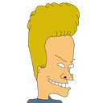

# slack-custom-emoji
Because existing emoji lack sufficient dank

Continuous Integration confirms each file matches Slack upload requirements

## Table o' Contents
- [Default Slack Emoji](#default-slack-emoji)
- [Other Resources Most Excellent](#other-resources-most-excellent)
- [Custom Emoji Styleguide Suggestions](custom-emoji-styleguide-suggestions)
- [Custom Emoji List](#custom-emoji-list)
- [Custom Slackbot Responses](#custom-slackbot-responses)

-----

### Default Slack Emoji
- [How to use Slack emoji](https://get.slack.help/hc/en-us/articles/202931348-Emoji-and-emoticons)
- [Slack Emoji Cheat Sheet](https://www.webpagefx.com/tools/emoji-cheat-sheet/)

### Other Resources Most Excellent
- [Cult of the Party Parrot](http://cultofthepartyparrot.com/)
- [Many Many Other Custom Emoji](https://slackmojis.com/)
- [Custom Emoji Packs](http://www.emojipacks.com/)
- [Slack Emoji Directory](http://www.slackemoji.com/)

### Custom Emoji Styleguide Suggestions
1. Format: `.png` to preserve transparency
2. Background removed (turned transparent)
3. Dimenions: 128px * 128px (even if emoji isn't) to preserve centering
4. Less than 64kb in size
5. Right-facing visual-direction (into whitespace)

### Custom Emoji List

| Emoji | Suggested Text | Emoji | Suggested Text | Emoji | Suggested Text |
|:-----:|:--------------:|:-----:|:--------------:|:-----:|:--------------:|
|  | :aint-nobody-got-time-for-that: |  | :air-quote-left: |  | :air-quote-right: |
|  | :always-watching: |  | :aw-yiss: |  | :angry-skeletor: |
|  | :aww: |  | :bat-signal: |  | :bogs: |
|  | :beavis: |  | :butthead: |  | :coding-cowboy: |
|  | :derp: |  | :disapproval: |  | :cornholio: |
|  | :do-not-want: |  | :dolan: |  | :failed: |
|  | :dolan-classic: |  | :feels-bad-man: |  | :feels-good-man: |
|  | :feels-good: |  | :gooby: |  | :hmmm: |
|  | :hodor: |  | :i-guess-with-emphasis: |  | :i-guess: |
|  | :impossibru: |  | :indeed: |  | :i-lied: |
|  | :magic-eight-ball: |  | :lolwut: |  | :neutral: |
|  | :mega-rage: |  | :nice: |  | :not-bad: |
|  | :rainbow-drool: |  | :one-does-not-simply: |  | :ruhroh: |
|  | :successful: |  | :thatd-be-great: |  | :this-is-fine: |
|  | :thats-what-i-like: |  | :tired-spongebob: |  | :troll-exclamation: |
|  | :troll-question: |  | :trollface-right: |  | :troll-dance: |
|  | :wat: |  | :waiting-spongebob: |  | :which-is-nice: |
|  | :why-not-zoidberg: |  | :wtf: |  | :yey: |
|  | :troll-period: |  | :taps-head: |

### Custom Slackbot Responses

#### [Magic 8-Ball](https://en.wikipedia.org/wiki/Magic_8-Ball)

<table style="width:100%">
  <tr>
    <th>When someone says</th>
    <th>Slackbot responds with (randomly selects one)</th>
  </tr>
  <tr>
    <td>:magic-eight-ball:</td>
    <td>"It is certain" 
        "It is decidedly so" 
        "Without a doubt" 
        "Yes definitely" 
        "You may rely on it" 
        "As I see it, yes" 
        "Most likely" 
        "Outlook good" 
        "Yes" 
        "Signs point to yes" 
        "Reply hazy try again" 
        "Ask again later" 
        "Better not tell you now" 
        "Cannot predict now" 
        "Concentrate and ask again" 
        "Don't count on it" 
        "My reply is no" 
        "My sources say no" 
        "Outlook not so good" 
        "Very doubtful"
    </td>
  </tr>
</table>
<table>
  <tr>
    <td>
      
    </td>
  </tr>
</table>
